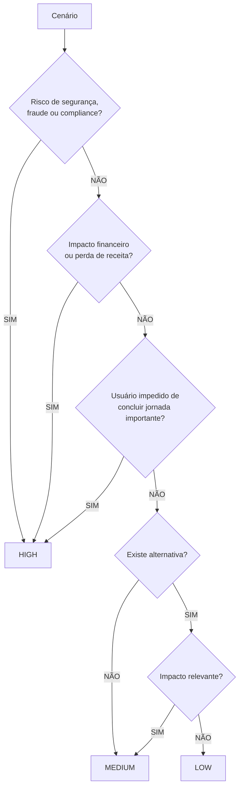

# Decisão de criticidade de testes

Fonte canônica para classificar cenários de teste neste repositório.  
Níveis: [HIGH](./high.md) · [MEDIUM](./medium.md) · [LOW](./low.md).

## Objetivo

Atribuir **uma** criticidade (`HIGH` | `MEDIUM` | `LOW`) a cada cenário, feature ou bug, para priorizar automação, revisão e execução.

## Como usar

1. Partir do cenário concreto (jornada, tela, risco).
2. Percorrer a árvore abaixo **de cima para baixo**; a **primeira** resposta afirmativa que leve a um nível define o resultado.
3. Em dúvida entre dois níveis: escolher o **mais alto** e registrar o motivo em 1 linha no teste/feature.
4. Não inventar nível intermediário (`critical`, `blocker`, etc.). Só `HIGH`, `MEDIUM`, `LOW`.

## Árvore de decisão

```text
Cenário
  │
  ▼
Existe risco de segurança, fraude ou compliance?
  ├── SIM → HIGH
  └── NÃO
        │
        ▼
      Existe impacto financeiro ou perda de receita?
        ├── SIM → HIGH
        └── NÃO
              │
              ▼
            O usuário fica impedido de concluir uma jornada importante?
              ├── SIM → HIGH
              └── NÃO
                    │
                    ▼
                  Existe alternativa?
                    ├── NÃO → MEDIUM
                    └── SIM
                          │
                          ▼
                        Impacto relevante?
                          ├── SIM → MEDIUM
                          └── NÃO → LOW
```



## Regras para agentes e desenvolvedores

| Situação | Ação |
|----------|------|
| Novo teste / feature | Classificar com esta árvore antes de escrever o caso |
| Bug report | Criticidade do **impacto no usuário/negócio**, não da dificuldade de automação |
| Conflito entre arquivos de nível | Este arquivo (`decision.md`) prevalece |
| Critério em `high` / `medium` / `low` | Usar para validar e exemplificar; a árvore decide |

## Tag sugerida

Nos specs/testes, preferir metadado explícito:

- `@criticality:high`
- `@criticality:medium`
- `@criticality:low`

## Glossário rápido

- **Jornada importante:** fluxo sem o qual o usuário não alcança o valor principal do produto (ex.: login, cadastro, pagamento, acesso a dados sensíveis).
- **Alternativa:** outro caminho viável no produto para o mesmo objetivo (mesmo que pior UX).
- **Impacto relevante:** degrada operação ou experiência de parcela significativa de usuários, sem bloquear jornada crítica nem gerar risco HIGH.
